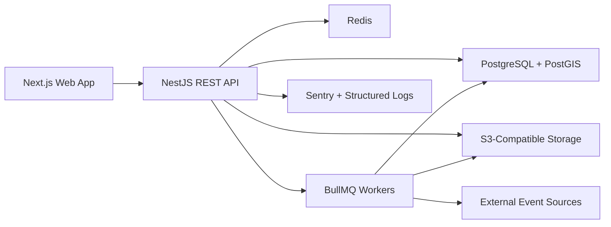

# MVP Architecture

## Product Scope

Платформа закрывает базовый контур спортивной социальной сети:

- профиль спортсмена
- импорт тренировок из файлов
- публикация и просмотр активностей
- социальные взаимодействия
- клубы
- каталог реальных спортивных событий
- отметки интереса и участия
- in-app уведомления
- административная панель

## Explicit Non-Goals

- собственный GPS-трекинг
- мобильные приложения в первом релизе
- сегменты
- чат в реальном времени
- подписка и платежи
- сложные рекомендательные механики
- микросервисы

## Recommended System Shape

Для MVP подходит модульный монолит:

- `Next.js` web client
- `NestJS` API
- `PostgreSQL + PostGIS` как основная БД
- `Redis + BullMQ` для очередей и кэшей
- `S3-compatible storage` для исходных файлов импорта и медиа

Это даёт:

- простую доставку первой версии
- прозрачную доменную модель
- отдельные асинхронные контуры без микросервисной сложности
- готовность к будущей mobile-app интеграции через REST API

## Domain Modules

### 1. Auth

- регистрация по email
- login/logout
- email verification
- password reset
- access token + refresh token
- rate limiting

### 2. Users and Profiles

- публичный профиль
- username
- bio, city, avatar
- выбранные виды спорта
- профильные агрегаты: статистика, клубы, события, активности

### 3. Activity Imports

- приём `FIT`, `GPX`, `TCX`
- создание `ImportJob`
- дедупликация по хэшу файла и нормализованным метаданным
- безопасный повтор job
- сохранение парсинга и ошибок

### 4. Activities

- activity core fields
- приватность
- activity file source
- activity route geometry
- stats: distance, duration, elevation, heart rate, calories

### 5. Feed

- лента по подпискам + собственные активности
- пагинация cursor-based
- fan-out on read для MVP

### 6. Social

- follows
- likes
- comments
- уведомления от социальных действий

### 7. Clubs

- создание клуба
- страница клуба
- членство
- редактирование владельцем

### 8. Events

- импорт событий из внешних источников
- нормализация данных
- фильтры по дате, региону, спорту
- ссылка на первоисточник
- изображение события
- идемпотентная синхронизация

### 9. Event Participation

- `interested`
- `going`
- отзыв отметки

### 10. Admin

- пользователи
- комментарии
- события
- import jobs
- ошибки импорта
- ручной запуск синхронизации событий
- audit log

## Architecture Diagram



## Request Flows

### Activity Import Flow

1. Пользователь загружает файл.
2. API сохраняет исходный файл в S3-compatible storage.
3. API создаёт `ImportJob` в статусе `queued`.
4. Worker читает файл, валидирует формат и считает fingerprint.
5. Если найден дубликат, job закрывается как `deduplicated`.
6. Если дубля нет, создаётся `Activity`, а при наличии трека и `ActivityRoute`.
7. Пользователь получает in-app уведомление об успехе или ошибке.

### Event Sync Flow

1. Администратор или scheduler запускает sync.
2. Sync service забирает события из внешних источников.
3. Данные нормализуются в общую модель `Event`.
4. По `source_name + source_event_id` выполняется upsert.
5. Удалённые или скрытые источником события не удаляются физически, а архивируются.

## Security Baseline

- хэширование паролей через `argon2id`
- access/refresh token pair
- refresh token rotation
- RBAC для admin
- rate limiting на auth и comments
- object-level access checks для приватных активностей
- audit log для административных действий

## Performance Strategy

Чтобы уложиться в требования MVP:

- индексы по `created_at`, `user_id`, `event_date`, `sport`
- keyset pagination для ленты и активностей
- предрасчёт простых counters: likes, comments, followers, members
- отложенная генерация route preview
- Redis для rate limit и hot-cache списков

## Suggested NestJS Modules

```text
src/
  modules/
    auth/
    users/
    profiles/
    activities/
    imports/
    feed/
    follows/
    likes/
    comments/
    clubs/
    events/
    notifications/
    admin/
    audit/
  infrastructure/
    db/
    queue/
    storage/
    maps/
    observability/
```

## Suggested Delivery Order

### Wave 1

- auth
- profiles
- activities
- import pipeline

### Wave 2

- follows
- feed
- likes
- comments

### Wave 3

- clubs
- events
- event participation

### Wave 4

- notifications
- admin
- audit log

## Definition of Done Mapping

Критерии готовности MVP считаются выполненными, когда:

- пользователь проходит auth end-to-end
- импорт создаёт видимую активность без явных дублей
- активность доступна в профиле и в ленте
- социальные действия создают реакции и уведомления
- клубы поддерживают базовое членство
- события доступны для просмотра и участия
- админ управляет событиями, комментариями и импортами
